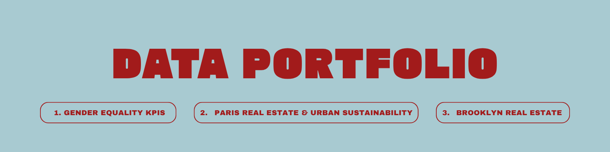
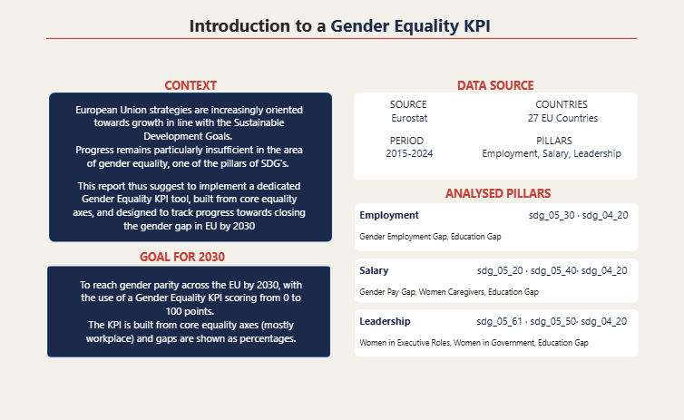
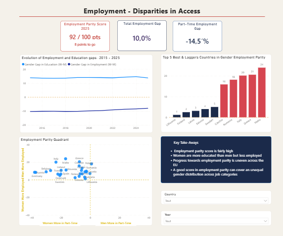
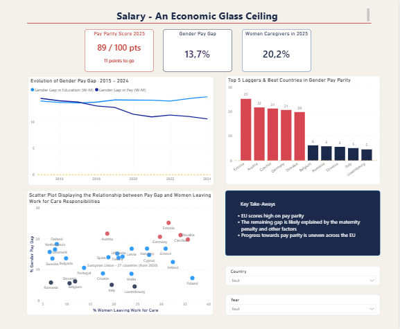
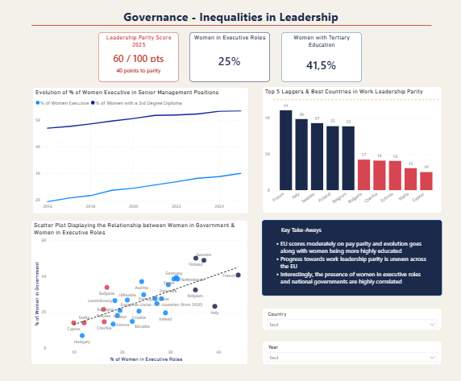
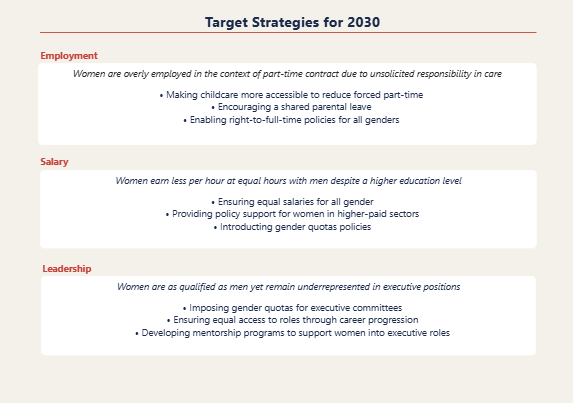

# Salomé Rolland - Data Analyst

> Bringing data and behavioral science together to drive better decisions

**Toolbox**

**Contact** · [LinkedIn](https://www.linkedin.com/in/salomé-rolland-4b8888425/) · [rollandsalome@gmail.com](mailto:rollandsalome@gmail.com)

# ‣ 1. Gender Equality KPIs Project

Analysis of gender equality in the workplace across the 27 EU member states, based on open data from Eurostat's Sustainable Development Goals dataset (https://ec.europa.eu/eurostat/web/sdi/database). The project covers the full data pipeline: extracting and cleaning the data in Power Query, star schema modeling (one fact table, three dimensions) and building an interactive Power BI dashboard based on several custom KPIs of gender equality.

Core research question: how significant is the workplace gender equality gap across the EU countries and which countries lead or lag?

## - ETL - Dimensional Modeling - Data Vizualization -

### Dimensional Modeling in Power BI

- Star Schema composed of FACT_Indicators_Gender_Equality, DIM_Date, DIM_Country & DIM_Indicator

### Visualization & Analysis of Data in Power BI

You can download the Power BI Project here : 

#### Insights

# ‣ 2. Paris Real Estate & Urban Sustainability

You can download the Power BI Project here : 

# ‣ 3. Brooklyn Real Estate

Analysis of the residential property sales in Brooklyn, based on open data from the NYC Department of Finance (https://www.nyc.gov/site/finance/property/property-rolling-sales-data.page). The project covers the full data pipeline: extracting & cleaning the files in SQL Server, star schema modeling (one fact table, three dimensions), then analyzing the data and building an interactive Tableau dashboard.

Core research question: what is the median price per neighborhood, and how do prices vary across space and time?

## - ETL - Dimensional Modeling - Data Vizualization -

### Dimensional Modeling on Draw DB

- Star Schema composed of FACT_Sales, DIM_Date, DIM_Geo & DIM_Attributes

### ETL Process & primary analyses on SQL Server Management Studio

[Full script available here](Rolling_Sales.sql)

### Visualization & Analysis of Data on Tableau Public

