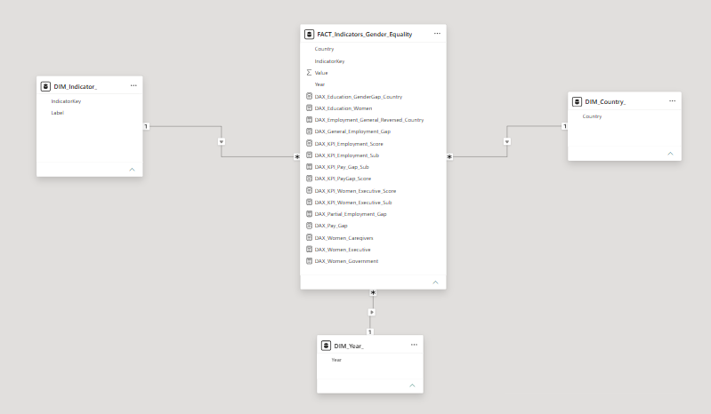
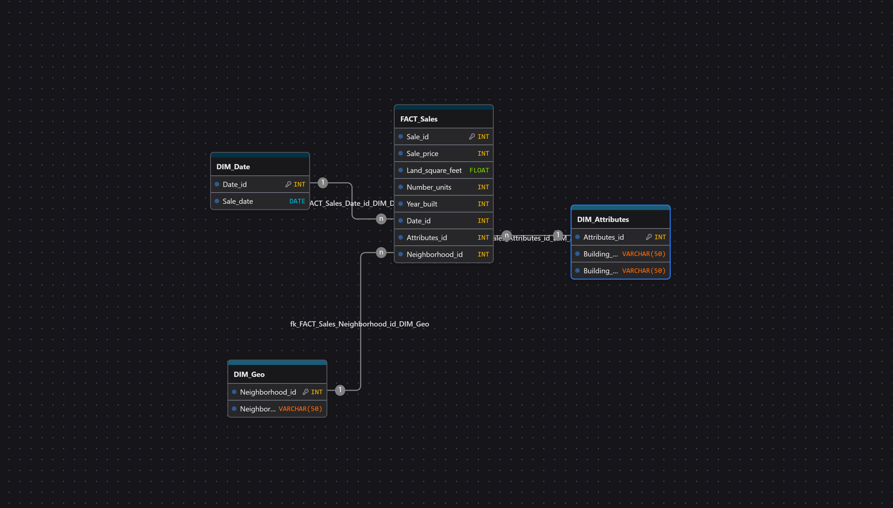
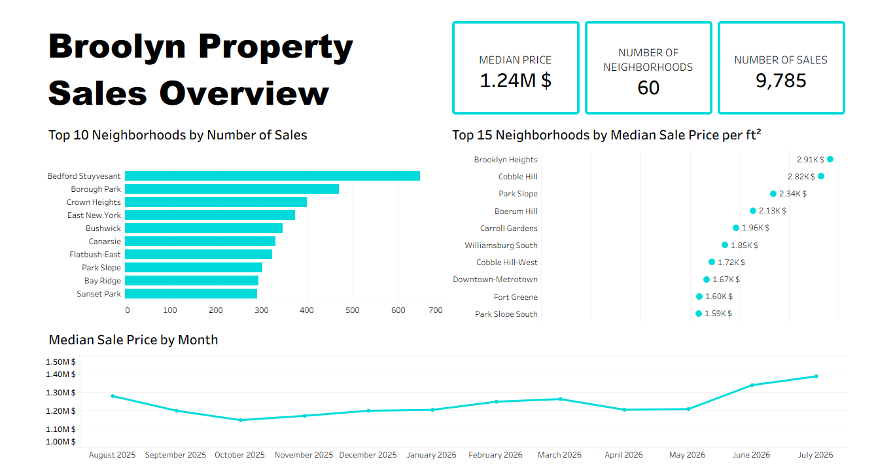
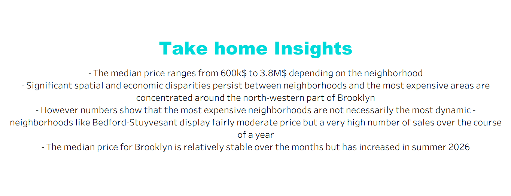

# 🔹 1. Gender Equality KPI Project

Analysis of gender equality in the workplace across the 27 EU member states, based on open data from Eurostat's Sustainable Development Goals dataset (https://ec.europa.eu/eurostat/web/sdi/database). The project covers the full data pipeline: extracting and cleaning the data in Power Query, star schema modeling (one fact table, three dimensions) and building an interactive Power BI dashboard based on several custom KPIs of gender equality.

Core research question: how significant is the workplace gender equality gap across the EU countries and which countries lead or lag?

## - ETL - Dimensional Modeling - Data Vizualization -

### Dimensional Modeling in Power BI

- Star Schema composed of FACT_Sales, DIM_Date, DIM_Geo & DIM_Attributes

# 🔹 2. Brooklyn Real Estate Project

Analysis of the residential property sales in Brooklyn, based on open data from the NYC Department of Finance (https://www.nyc.gov/site/finance/property/property-rolling-sales-data.page). The project covers the full data pipeline: extracting & cleaning the files in SQL Server, star schema modeling (one fact table, three dimensions), then analyzing the data and building an interactive Tableau dashboard.

Core research question: what is the median price per neighborhood, and how do prices vary across space and time?

## - ETL - Dimensional Modeling - Data Vizualization -

### Dimensional Modeling on Draw DB

- Star Schema composed of FACT_Sales, DIM_Date, DIM_Geo & DIM_Attributes

### ETL Process & primary analyses on SQL Server Management Studio

[Full script available here](Rolling_Sales.sql)

#### Primary Analyses

--"WHAT IS THE MEAN PRICE PER NEIGHBORHOOD?"--

SELECT
AVG(a.Sale_price) as Mean_price,
b.Neighborhood_name
FROM FACT_Sales as a
JOIN DIM_GEO as b
    ON a.Neighborhood_id = b.Neighborhood_id
GROUP BY Neighborhood_name
ORDER BY Mean_Price DESC

--RESULTS--
--Based on the mean price, Gowanus (5M$) is almost 9 times more expensive than Coney Island (600k$)--
--However the gaps in the mean also indicate that the mean is highly sensitive to outliers in price of sales--
--Thus, for further analyses, the median price will be used to better overcome the outliers sensitivity issue--

---------------------------------------------------------------------------------

--"WHAT IS THE MEDIAN PRICE PER NEIGHBORHOOD?"--

SELECT DISTINCT
    b.Neighborhood_name,
    PERCENTILE_CONT(0.5) WITHIN GROUP (ORDER BY a.Sale_price) OVER (PARTITION BY b.Neighborhood_name) as Median_price
FROM FACT_Sales as a
JOIN DIM_GEO as b
    ON a.Neighborhood_id = b.Neighborhood_id
ORDER BY Median_price DESC

--RESULTS--
--Based on the median price, number show a 6* gap between the most affordable neighborhood (Gerritsen Beach)
--and the most expensive one (Brooklyn Heights)
--Thus hinting significant spatial inequalities between neighborhoods even when the outliers sensitivity is lowered--

-----------------------------------------------------

--"WHICH ARE THE 3 MOST EXPENSIVE NEIGHBORHOODS?"--

SELECT DISTINCT
TOP 3
    b.Neighborhood_name,
    PERCENTILE_CONT(0.5) WITHIN GROUP (ORDER BY a.Sale_price) OVER (PARTITION BY b.Neighborhood_name) as Median_price
FROM FACT_Sales as a
JOIN DIM_GEO as b
    ON a.Neighborhood_id = b.Neighborhood_id
ORDER BY Median_price DESC

--RESULTS--
--The most expensive neighborhoods based on the median price are Brooklyn Heights, Cobble Hill and Carroll Gardens
--This appears consistent with reality as those three neighborhoods are located in the north-western part of Brooklyn
--close to the waterfront and Manhattan--

-----------------------------------------------------

--"WHAT IS THE MEDIAN PRICE PER SQUARE FEET PER NEIGHBORHOOD?"--

SELECT DISTINCT
b.Neighborhood_name,
PERCENTILE_CONT(0.5) WITHIN GROUP (ORDER BY (a.Sale_price/a.Land_Square_Feet)) OVER (PARTITION BY b.Neighborhood_name) as Median_price_per_sqf
FROM FACT_Sales as a
JOIN DIM_GEO as b
    ON a.Neighborhood_id = b.Neighborhood_id
WHERE Land_Square_Feet <> 0
ORDER BY Median_price_per_sqf DESC

--RESULTS--
--The median price per sqft varies greatly between neighborhoods
--the most expensive neighborhoods such as Brooklyn Heights or Cobble Hill display a price over 10 times higher
--than the least expensive ones, such as Coney Island or Seagate
--This analyse confirms significant spatial and economic inequalities between neighborhoods inside Brooklyn--

-----------------------------------------------------

--"HOW HAS THE MEDIAN PRICE EVOLVED OVER TIME?"--

SELECT DISTINCT
YEAR(b.Sale_Date) as Year,
MONTH(b.Sale_Date) as Month,
PERCENTILE_CONT(0.5) WITHIN GROUP(ORDER BY a.Sale_price) OVER (PARTITION BY MONTH(b.Sale_Date), YEAR(b.Sale_Date)) as Median_price
FROM FACT_Sales as a
JOIN DIM_Date as b
    ON a.Date_id = b.Date_id
ORDER BY Year, Month

--RESULTS--
--The median price has evoled by 7.8% between August 2025 and July 2026 in Brooklyn, a significant increase in sale prices--

### Visualization & Analysis of Data on Tableau Public

